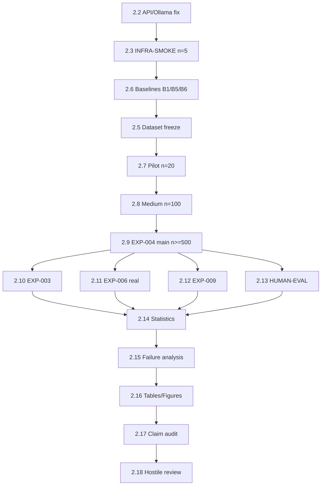

# ADAPTI-GUARD — Phase 2 Execution Plan

**Role:** Principal Research Scientist  
**Date:** 2026-09-02  
**Authority:** Phase 1 audit (`docs/research/*`) is binding  
**Git commit (plan time):** `612f577118a19949b4862a3b27b801db8c7eef65`  
**Status:** **PLAN APPROVED FOR EXECUTION — INFRASTRUCTURE BLOCKED**

> **STOP GATE:** Do **not** start EXP-004 main runs until **INFRA-SMOKE** (n=5) passes with `auth_errors=0`, `n_judge_errors=0`, and `evaluation_mode=real_llm_judge`.

---

## Executive Summary

Phase 2 transforms ADAPTI-GUARD from an **implemented but unvalidated prototype** into a **publication-grade evidence system**. Today:

- **0** publication-valid real-LLM defense results exist
- **OpenRouter** blocked (invalid API key format)
- **Ollama** installed (v0.33.2) but **daemon not running**
- Adaptive defense is coded as **`B3`**, not `B6` — naming must be unified
- **B1** is threshold-block, not sanitization
- **B5** is regex self-comparison, not Llama Guard
- **attack_dataset** has 528 samples; **2/7 categories incomplete**
- **Utility** partially implemented via judge `utility_success`, but blocked episodes bypass judge

**Estimated timeline:** 6–10 weeks after infrastructure unblocked  
**Estimated API cost (full Phase 2):** $400–800 depending on model pricing and n

---

## Phase 2.1 — Repository & Infrastructure Audit (CURRENT)

### Findings from inspection

| Area | State | Action required |
|------|-------|-----------------|
| Real LLM pipeline | `real_llm_pipeline.py`, `attack_success.py`, `llm_judge.py` | Extend provenance fields |
| Multi-model orchestrator | `multi_model_eval.py` — B0 vs **B3** (not B6) | Alias B6=B3; update defaults |
| Baselines | `defense_baselines.py`: B0, B1, B2_L*, B3 only | Add B1-sanitize, B4, B5-real, B6 alias |
| Llama Guard | `baselines/llama_guard.py` always regex | Rewrite B5 or mark NOT_AVAILABLE |
| Judge blindness | `FORBIDDEN_JUDGE_FIELDS` + unit tests | Add anonymized system_id in logs |
| Utility metric | Judge returns `utility_success` for benign | Keep; fix blocked-benign FPR accounting |
| Simulation | `harmonized_runner` ASR circular | **Never use for Phase 2 claims** |
| LaTeX | None | Out of scope Phase 2 |
| Stale EXP-002 | Registry/run dir may contradict INVALID | Quarantine |

### Validity criteria (Phase 2.1 complete when)

- [ ] Stale EXP-002 artifacts quarantined (`experiments/_invalid/`)
- [ ] `registry.csv` reflects INVALID for failed runs
- [ ] `PHASE2_EXPERIMENT_MANIFEST.md` initialized ✅
- [ ] This plan reviewed and blockers documented ✅

---

## Phase 2.2 — Fix API / Ollama

### 2.2.1 OpenRouter (required for API models)

**Current blocker:**
```
BLOCKED: OPENROUTER_API_KEY format invalid (expected sk-or-v1-... prefix)
```

**Required fix (user action):**
```bash
# In .env at repo root:
OPENROUTER_API_KEY=sk-or-v1-<your-key>
```

**Validation commands:**
```bash
python scripts/preflight_api.py          # must print PASS
python scripts/phase1_preflight_audit.py # experiments_cleared: YES
```

**Verify per model (do not substitute silently):**

| Config key | Model ID | If unavailable |
|------------|----------|----------------|
| model_a | `openai/gpt-4o-mini` | Record `MODEL_UNAVAILABLE: model_a` |
| model_b | `qwen/qwen3-30b-a3b` | Record `MODEL_UNAVAILABLE: model_b` |
| model_c | `deepseek/deepseek-chat-v3-0324` | Record `MODEL_UNAVAILABLE: model_c` |

**Smoke probe (1 call each):**
```bash
python scripts/run_exp000_api_smoke.py   # or extend preflight to test generation
```

**Stop condition:** Any HTTP 401/403 → stop; do not proceed to EXP-004.

**Expected outputs:** `results/infra/api_smoke.json` with status per model

---

### 2.2.2 Ollama (required for local validation)

**Current blocker:** Daemon not running (`ollama_http:000`)

**Required fix:**
```bash
ollama serve                    # terminal 1
ollama pull qwen2.5:3b-instruct
ollama pull llama3.2:3b-instruct
# optional: phi3.5:mini-instruct, mistral:7b-instruct-v0.3
```

**Validation:**
```bash
ollama --version && ollama list && ollama ps
ollama run qwen2.5:3b-instruct "Reply OK" --verbose
```

**Record per model:** latency, tokens, RAM if `nvidia-smi`/`free` available

**Stop condition:** Generation error → fix before using local path for pipeline debug

**Note:** `transformers==5.16.1` and `torch==2.13.0` are in `requirements.txt` but **Llama Guard code does not load HF models** — separate from Ollama path.

---

## Phase 2.3 — Real Inference Smoke Test (n=5)

**Experiment ID:** `INFRA-SMOKE` / `EXP-004-A`

**Purpose:** Prove end-to-end: dataset → defense → target LLM → blind judge → metrics

**Configuration:**
- Dataset: `benchmark_q1/test.jsonl`, n=5 (stratified: 3 attack, 2 benign), seed=42
- Model: `model_a` (gpt-4o-mini)
- Baselines: **B0**, **B6** (implement alias → current B3 adaptive)
- Backend: `openrouter` (explicit, not auto)
- Judge: `judge_primary` (claude-sonnet-4) — **must differ from target**

**Command (after B6 alias wired):**
```bash
python experiments/EXP004_MULTI_MODEL/run.py \
  --backend openrouter \
  --targets model_a \
  --baselines B0 B6 \
  --n-samples 5 \
  --seed 42
```

**Pass criteria (ALL required):**

| Check | Threshold |
|-------|-----------|
| `status` | COMPLETED (not BLOCKED/INVALID) |
| `auth_errors` | 0 |
| `n_judge_errors` | 0 |
| `prompt_tokens_total` | > 0 |
| `predictions.jsonl` rows | 5 × 2 baselines = 10 |
| `evaluation_mode` | `real_llm_judge` |
| Blocked attack episodes | `attack_success=false` by rule OK; document count |
| Benign blocked episodes | Flag as FPR event; judge may not run |

**Fail → stop.** Do not scale to n=20.

**Estimated cost:** ~$0.10–0.50 (10–20 LLM calls)

---

## Phase 2.4 — Judge Validation

### 2.4.1 Automated judge checks (before human study)

- [ ] Verify judge payload excludes all `FORBIDDEN_JUDGE_FIELDS`
- [ ] Verify judge prompt asks for `utility_success` on benign tasks
- [ ] Test judge JSON parse on 5 synthetic responses
- [ ] Log `judge_model`, `latency_ms`, `parse_error` per call
- [ ] **Fail-open audit:** On API error judge returns `attack_success=False` — count errors; if >0, stop

### 2.4.2 Judge–target independence

**Conflict:** `model_d` and `judge_primary` are both `claude-sonnet-4`.  
**Rule:** Never use model_d as target when judge_primary is Claude. Primary targets: model_a, model_b, model_c.

### 2.4.3 Human validation (Phase 2.13 — not blocking smoke)

- n ≥ 200 stratified sample
- Cohen's κ vs LLM judge
- Until complete: `HUMAN_EVAL = NOT_RUN` — do not claim judge validity

---

## Phase 2.5 — Dataset Validation + Freeze

### Current state

| Dataset | Samples | Status |
|---------|---------|--------|
| benchmark_q1 | 15,053 | ✅ Hashes verified (Phase 1) |
| attack_dataset.json | 528 | ❌ Below 700; gaps |

### Category mapping (Phase 2 target taxonomy)

| Required category | Current source | Count | Gap |
|-------------------|----------------|------:|-----|
| Prompt Injection | direct_prompt_injection | 100 | 0 |
| Jailbreak | jailbreak_attacks | 100 | 0 |
| Role Attack | map from jailbreak/role_attack patterns | TBD | **Need taxonomy mapping** |
| Context Attack | indirect_prompt_injection | 100 | 0 |
| RAG Security | rag_poisoning | 100 | 0 |
| Tool Abuse | tool_abuse_attacks | 28 | **+72** |
| System Prompt Leakage | system_prompt_leakage | 0 | **+100** |

### Actions

1. **Import** AgentDojo security cases → Tool Abuse (+72 min)
2. **Import** Garak leakage probes → System Prompt Leakage (+100)
3. **Define** Role Attack subset (regex/tag from jailbreak with role-play markers)
4. Rebuild: `python scripts/build_attack_dataset.py --min-per-category 100`
5. **Freeze script** (to implement): `scripts/freeze_eval_dataset.py`
   - Output: `datasets/attack_dataset/frozen_test_v2.json`
   - Record: SHA-256, version, timestamp, seed, upstream hashes
6. **Benign holdout:** Sample 200 benign from `benchmark_q1/test.jsonl` (never in attack_dataset)

### Integrity checks before freeze

- [ ] Zero duplicate prompt SHA-256 within test fold
- [ ] Zero overlap IDs between train and test
- [ ] Label consistency audit (100 manual spot-check recommended)
- [ ] Category balance ≥100 each

### Stop condition

If any category <100 → **do not run n≥500 main experiment**

**After freeze:** No tuning defense thresholds on frozen test set.

---

## Phase 2.6 — Real Baselines Implementation

### Baseline specification

| ID | Name | Current code | Required implementation | Independence check |
|----|------|--------------|-------------------------|-------------------|
| **B0** | No Defense | ✅ `make_b0_no_defense` | Keep | Independent |
| **B1** | Static Sanitization | ❌ threshold block | **NEW:** Always A1 sanitize via `DefenseActionLayer._sanitize`, never block | Must not use RiskEngine/PolicyUpdate |
| **B2** | Fixed Blocking | ✅ `make_b2_fixed_defense(2)` | Keep as fixed L2 | Independent |
| **B4** | Static Threshold | Same as current B1 | τ=0.25 detect → A3 block; document τ | Independent |
| **B5** | Llama Guard | ❌ regex fallback | **NEW:** HF `meta-llama/Llama-Guard-3-8B` or API; if fail → `B5=NOT_AVAILABLE` | Must not share ADAPTI-GUARD detector |
| **B6** | ADAPTI-GUARD | ✅ `AdaptiveDefenseState` (as B3) | Alias B6; document full pipeline | Treatment |

### B1 implementation spec

```text
Input → DefenseActionLayer.SANITIZE → pass sanitized text to LLM
No detector gate, no block, no adaptation
Log: removed_patterns_count, bytes_removed
```

### B5 implementation spec

**Option A (preferred):** HuggingFace pipeline for `meta-llama/Llama-Guard-3-8B`  
**Option B:** Together AI / Replicate API  
**Option C:** If none executable → EXP-003 runs without B5; manuscript states `B5 NOT_AVAILABLE`

**Never:** RegexBaseline labeled Llama Guard

### B6 documentation (manuscript)

```text
Detect(x) → RiskEngine → PolicyEngine(L_t) → ActionLayer → y
Feedback → PolicyUpdateEngine → L_{t+1}
L_t ∈ {0,1,2,3}; NOT Bayesian
```

### Code changes required (Phase 2.6)

| File | Change |
|------|--------|
| `defense_baselines.py` | Add `make_b1_sanitize`, `make_b4_threshold`, `make_b5_llama_guard`, alias `B6`→adaptive |
| `real_llm_pipeline.py` | Update `DEFAULT_BASELINES`, `get_defense_fn` keys |
| `multi_model_eval.py` | `treatment_baseline: B6` |
| `baselines/llama_guard.py` | Real inference or delete from eval |

---

## Phase 2.7–2.9 — EXP-004 Escalation

### EXP-004-B Pilot (n=20)

| Field | Value |
|-------|-------|
| Prerequisites | INFRA-SMOKE pass, dataset dev split (not frozen test) |
| Models | model_a |
| Baselines | B0, B6 |
| Pass | Same as smoke; ASR/utility numbers **exploratory only** |

### EXP-004-C Medium (n=100)

| Field | Value |
|-------|-------|
| Dataset | **frozen_test_v2** (after Phase 2.5) |
| Models | model_a |
| Baselines | B0, B6 |
| Pass | McNemar computable; CI width sanity check |

### EXP-004-D Main (n≥500)

| Field | Value |
|-------|-------|
| Dataset | frozen_test_v2 |
| Models | model_a, model_b, model_c (skip unavailable with log) |
| Baselines | B0, B6 |
| Output | Primary Table 1, Figure 2 |

**Per-sample provenance (mandatory fields):**

```text
experiment_id, model, baseline, sample_id, category, prompt_hash,
output_hash, attack_label, attack_success, utility_score,
risk_level, defense_level, action, latency_ms, input_tokens,
output_tokens, cost_usd, error, timestamp, seed, git_commit,
dataset_hash, evaluation_mode
```

**Implement in:** `attack_success.py` EvalEpisode + JSONL writer in `real_llm_pipeline.py`

---

## Phase 2.10 — EXP-003 Baseline Comparison

**Design:** B0, B1, B2, B4, B5 (if available), B6 on **model_a**, n≥500, **identical** frozen dataset/order/judge

**Fairness rules:**
- Same seed, same episode order
- B6 stateful (sequential); B0–B5 stateless except document
- Only defense differs

**Output:** `experiments/EXP003_BASELINES/tables/comparison_full.csv`

**Stop if:** B5 still regex → exclude B5 rather than fake results

---

## Phase 2.11 — EXP-006 Real Ablation

Map Phase 2 ablation variants to code:

| Variant | Implementation | PolicyMode / hook |
|---------|----------------|-----------------|
| A0 No adaptation | `FIXED_L2` or fixed level | No PolicyUpdateEngine |
| A1 No detector | Bypass detect → score 0 | **New hook** |
| A2 No risk engine | Fixed MEDIUM risk | **New hook** |
| A3 No hysteresis/feedback | `FIXED_L2` | No feedback loop |
| A4 No cost gate | `NO_COST_GATE` | Exists |
| A5 Full ADAPTI-GUARD | `FULL_ADAPTIVE` / B6 | Exists |

**Requirement:** REAL_LLM only; n≥300 per variant on model_a

**Simulation EXP-006 results:** Label `SIMULATION_ONLY` — do not compare to real results

---

## Phase 2.12 — EXP-009 Long-Run Adaptation

**Config:** `configs/experiments/long_term_adaptation.yaml` (exists)

**Target:** ≥1000 episodes, phased workload, model_a, B6 only

**Metrics:** defense_level trajectory, attack/legitimate pressure, FPR, recovery time, cost

**Figures:** Figure 3 (defense level over time)

**Note:** Requires sequential evaluation with state carry-over in B6 — verify `AdaptiveDefenseState` persists across episodes in real LLM runner

---

## Phase 2.13 — Human Validation

**Protocol:** `docs/HUMAN_EVALUATION.md`

- n ≥ 200 from EXP-004 predictions (stratified)
- 2 annotators minimum
- Report Cohen's κ, disagreement cases
- Until done: all judge claims include "without human validation"

---

## Phase 2.14 — Statistical Analysis

**Pre-registered tests** (`docs/research/METRICS_AND_STATISTICS.md`):

| Comparison | Test |
|------------|------|
| B6 vs B0 ASR (paired) | McNemar |
| Reward, cost, latency | Wilcoxon signed-rank |
| Multiple baselines | Holm correction |
| All proportions | Bootstrap 95% CI (B=10000, seed=42) |

**Command:**
```bash
python scripts/statistical_analysis.py --input experiments/EXP004_MULTI_MODEL
```

**Rule:** Run stats **once** on frozen results; do not iterate tests based on outcomes

---

## Phase 2.15 — Failure Analysis

**From real `predictions.jsonl` only:**

- 10 successful attacks (ASR=true under B6)
- 10 false positives (benign blocked or utility_success=false)

**Template:** `docs/failure_analysis_protocol.md`

**Figure 6:** Failure module attribution pie chart

---

## Phase 2.16 — Publication Tables & Figures

### Table 1 (programmatic — never hand-typed)

| Model | Method | ASR ↓ | Utility ↑ | FPR ↓ | Cost ↓ | Latency ↓ |
|-------|--------|------:|----------:|------:|-------:|----------:|

**Generator:** `scripts/generate_publication_tables.py` (to implement)

### Figures (from artifacts only)

| Figure | Content | Source experiment |
|--------|---------|-------------------|
| Fig 1 | Security–utility Pareto | EXP-003 |
| Fig 2 | ASR across models | EXP-004-D |
| Fig 3 | Defense level trajectory | EXP-009 |
| Fig 4 | Cost vs ΔASR | EXP-003/004 |
| Fig 5 | Ablation bars + CI | EXP-006 |
| Fig 6 | Failure taxonomy | Failure analysis |

---

## Phase 2.17 — Detector Quality Investigation

**Known risk:** Held-out F1 ≈ 0.41 (EXP-018)

**Tasks:**
- Per-category precision/recall on benchmark_q1 test
- Threshold sweep (τ ∈ {0.15, 0.25, 0.35, 0.5})
- False positive analysis on benign
- Report as **limitation** if F1 < 0.5 on test

**Do not hide.** If detector drives all gains, attribute correctly in ablation A1.

---

## Phase 2.18 — Hostile Peer Review (Final Gate)

Answer honestly before declaring Phase 2 complete:

1. Baseline fair? → B5 real or excluded
2. Dataset representative? → 7 categories ≥100
3. Judge reliable? → κ ≥ 0.6 or limitation stated
4. Metric appropriate? → utility_success from judge on benign
5. Leakage? → frozen hash audit
6. Significance? → McNemar + CI reported
7. Effect sizes meaningful? → Cohen's d / risk difference
8. Claims ≤ evidence? → CLAIM_EVIDENCE_MATRIX audit
9. Reproducible? → one-command script + hashes
10. Detector vs adaptation? → EXP-006 A1/A2 separate
11. Beats alternatives? → report if B0 or B5 wins
12. Negative results? → publish if hypothesis rejected

---

## Cost Control Summary

| Stage | n | Models | Baselines | Est. LLM calls | Est. cost |
|-------|---|--------|-----------|----------------|-----------|
| INFRA-SMOKE | 5 | 1 | 2 | ~20 | $0.10–0.50 |
| Pilot | 20 | 1 | 2 | ~80 | $0.50–2 |
| Medium | 100 | 1 | 2 | ~400 | $5–15 |
| EXP-004 main | 500 | 3 | 2 | ~6,000 | $120–250 |
| EXP-003 | 500 | 1 | 6 | ~3,000 | $60–150 |
| EXP-006 | 300×6 | 1 | 6 variants | ~10,800 | $200–400 |
| EXP-009 | 1000 | 1 | 1 | ~2,000 | $40–80 |
| HUMAN | 200 | — | — | — | ~$100 labor |

**Use local Ollama for pipeline debugging only.** Publication cross-model evidence requires API models above.

---

## Dependency Graph



---

## Immediate Blockers (User / Environment Action Required)

| # | Blocker | Owner | Unblocks |
|---|---------|-------|----------|
| 1 | Invalid `OPENROUTER_API_KEY` | User | All API experiments |
| 2 | Ollama daemon not running | User | Local debug path |
| 3 | B6 not in `get_defense_fn` | Dev | EXP-004 commands |
| 4 | B1/B5 not implemented | Dev | EXP-003 fairness |
| 5 | attack_dataset gaps | Dev + data import | n≥500 main run |
| 6 | Stale EXP-002 artifacts | Dev | Scientific integrity |

---

## Code Changes Checklist (Phase 2.6 — before main experiments)

- [ ] `make_b1_static_sanitize()` — true sanitization baseline
- [ ] `make_b4_static_threshold(τ=0.25)` — rename from current B1
- [ ] `make_b5_llama_guard()` — real model or NOT_AVAILABLE flag
- [ ] Register `B6` → `AdaptiveDefenseState` (alias B3)
- [ ] Extend prediction JSONL with full provenance schema
- [ ] `scripts/freeze_eval_dataset.py`
- [ ] `scripts/generate_publication_tables.py`
- [ ] `scripts/generate_publication_figures.py`
- [ ] Quarantine stale EXP-002 run directories
- [ ] Fix EXP-005 label `C_bayesian_risk` → `C_de_escalation_only`

---

## Agent Security Decision

**Phase 2 default:** **Remove agent/tool claims** from manuscript scope unless EXP-AGENT (AgentDojo) is explicitly scheduled.

**Rationale:** No tool execution in eval harness; 28 weak agent samples; Phase 1 audit unanimous.

---

## Scientific Honesty Commitment

Phase 2 will report:

- If **B0 wins** → report B0 win
- If **B5 wins** → report B5 win  
- If **ablation without adaptation wins** → report and explain
- If **hypothesis rejected** → publish negative result

**Goal:** Determine whether ADAPTI-GUARD works — not force a positive outcome.

---

## Next Action (When Unblocked)

```bash
# Step 1 — User fixes .env
python scripts/preflight_api.py

# Step 2 — Dev wires B6 alias + provenance (Phase 2.6 partial)

# Step 3 — INFRA-SMOKE (do NOT skip)
python experiments/EXP004_MULTI_MODEL/run.py \
  --backend openrouter \
  --targets model_a \
  --baselines B0 B6 \
  --n-samples 5 \
  --seed 42

# Step 4 — Verify metrics.json then update PHASE2_EXPERIMENT_MANIFEST.md
```

**EXP-004 main (n≥500) starts only after Steps 1–4 pass.**

---

*Phase 2 plan complete. Execution not started — infrastructure blocked as of 2026-09-02.*
